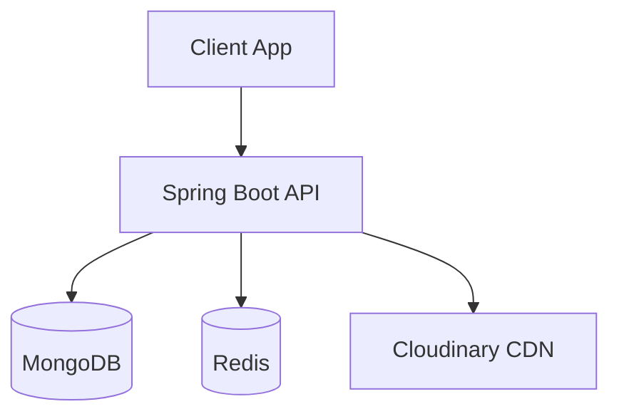
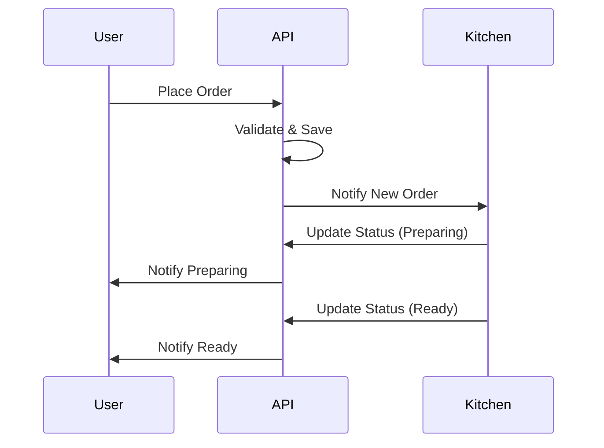

# DeQueue


DeQueue is a robust SaaS backend platform for restaurant and vendor queue management, providing order processing, vendor settings, and a multi-departmental staff structure. 

## Features
- **Multi-Vendor Architecture**: Support for multiple vendors on a single platform.
- **Departmental Queues**: Kitchen, Counter, and Admin separation.
- **Menu Management**: Configurable items and customization groups.
- **QR Code Ordering**: Metadata for QR code generation and validation.
- **Real-Time Queues**: Websocket/Polling friendly design using Redis.
- **Security**: JWT-based authentication and role-based access.

## Tech Stack
- **Java 21** / Spring Boot 3
- **MongoDB 7** (Primary Data Store)
- **Redis 7** (Caching & Real-Time Queue state)
- **Docker & Docker Compose** (Containerization)

## Architecture Diagram


## Prerequisites
- Docker and Docker Compose
- Java 21 & Gradle (for manual build)

## Quick Start (Docker Compose)
1. Copy the `.env.example` file to `.env` and fill in your details:
   ```bash
   cp .env.example .env
   ```
2. Start the services:
   ```bash
   docker-compose up -d
   ```
3. The app will be running at `http://localhost:8080`.

## Manual Setup
1. Ensure MongoDB and Redis are running locally.
2. Build the project: `./gradlew build`
3. Run the application: `java -jar build/libs/app.jar`

## Project Structure
```text
D:\DeQueue
├── src/main/java       # Source Code
├── docker/             # Docker initialization scripts
├── docs/               # Documentation
├── Dockerfile          # Multi-stage Dockerfile
├── docker-compose.yml  # Docker compose configuration
└── build.gradle        # Gradle dependencies
```

## MongoDB Collections
- `vendors`, `staff`, `departments`, `categories`, `menu_items`, `customization_groups`
- `orders`, `qr_metadata`, `vendor_profiles`, `vendor_settings`, `refresh_tokens`, `audit_logs`

## Redis Keys
- Session caching, order queues, rate limiting limits.

## API Endpoints Table
See [API Documentation](docs/API.md) for full details.

| Module | Base Path | Description |
|--------|-----------|-------------|
| Auth | `/api/v1/auth` | Login, Registration, Token Refresh |
| Vendors | `/api/v1/vendors` | Vendor management |
| Orders | `/api/v1/orders` | Order placement and tracking |
| Menu | `/api/v1/menu` | Items, categories, customizations |

## Authentication Flow
JWT Bearer token approach. Send `Authorization: Bearer <token>` in headers.

## Order Flow Diagram


## Queue Management
Orders are sorted by `vendorId`, `status`, and `createdAt` to form the queue.

## Roadmap
- [ ] Payment Gateway Integration
- [ ] Subscriptions Billing
- [ ] Push Notifications for Mobile Apps

## Contributing
Follow the standard fork-branch-PR model. See `CONTRIBUTING.md` for more.

## License
MIT License
