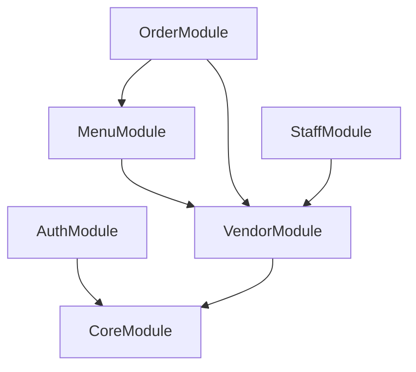

# Architecture Documentation

## System Architecture Overview
DeQueue is a multi-tenant SaaS application built to handle high concurrency in queue management. The system is broken down into modules that manage Vendors, Menu/Inventory, Staff/Departments, and Real-Time Orders.

## Module Dependency Diagram

## Database Design (Collections)
MongoDB is chosen for its document model flexibility. 
- **Vendors**: Core tenant entity.
- **Departments & Staff**: RBAC control per vendor.
- **Categories & Menu Items**: Normalized within the vendor boundary.
- **Customization Groups**: Reusable options across items.
- **Orders**: The highest volume collection, indexed heavily by vendorId and status.
- **Audit Logs**: Time-series collection tracking operational changes.

## Redis Usage Patterns
- **Token Blacklisting**: Invalidating JWTs upon logout.
- **Queue Caching**: Caching active order IDs to prevent frequent DB polling.
- **Rate Limiting**: Throttling requests to prevent abuse.

## Event System Design
Domain events (e.g., `OrderPlacedEvent`, `OrderReadyEvent`) are published internally using Spring ApplicationEvents to decouple the HTTP request handling from notification logic (like sending WebSockets or emails).

## Security Architecture
- Spring Security with JWT filter.
- Passwords hashed using BCrypt.
- Endpoints secured with `@PreAuthorize` based on role (ADMIN, STAFF) and matching `vendorId`.

## Deployment Architecture
- Docker containers deployed via Docker Compose or Kubernetes.
- Stateless App containers.
- Stateful DB/Redis volumes.
- API requests load-balanced externally.

## Scalability Considerations
- Orders collection can be sharded by `vendorId` in MongoDB if data grows massively.
- Websocket scaling will require Redis Pub/Sub backplane.

## Future Extension Points
- **Payments**: Webhook handlers for Stripe/Razorpay.
- **Subscriptions**: Recurring billing engine for vendors.
- **Mobile Apps**: Dedicated API endpoints with optimized payload sizes.
- **Multi-branch**: Parent/Child relationship in Vendors collection.
